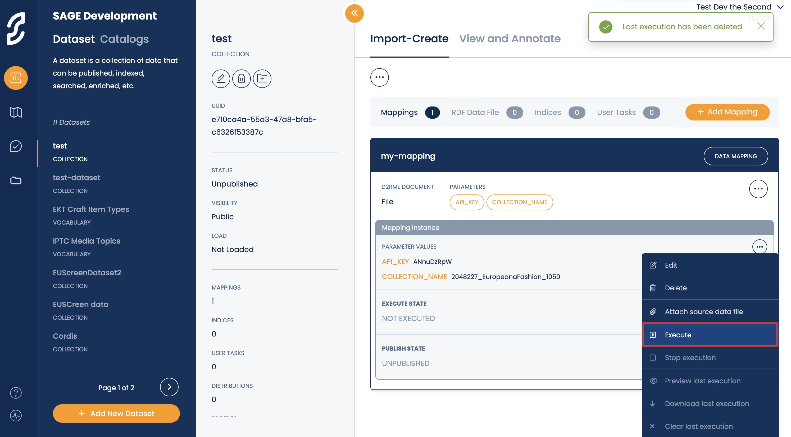

# SAGE Introduction

## What is SAGE?

SAGE is a platform that leverages the use of Linked Data and AI in order to provide Automatic Enrichments on metadata, along with a validation functionality.

## Data flow inside SAGE

`Import from source -> Map metadata to RDF -> Publish on triplestore -> Enrich metadata with the use of Annotators -> Validate the Results -> Export the results`

## How SAGE treats data

In SAGE, every operation on metadata is separated into 2 distinct steps: 

"**EXECUTION**": During the Execution step, the metadata is processed, enriched etc and the result is stored as RDF files, without uploading anything to the triplestore.

"**PUBLICATION**": During the Publication step, the RDF files containing the result of the execution are uploaded to the triplestore, so that further stages of the metadata processing pipeline can occur.

You will see this pattern appearing in every aspect of SAGE interaction with metadata, eg Metadata Importation, Annotator execution etc.

# Data Importation 

## Introduction

Using SAGE, you can import data from multiple sources in various formats, in order to later perform operations on them. The data is harvested from remote APIs, mapped to RDF triples, and then stored in a triple store.

During the "**EXECUTION**" step, the data is harvested and mapped to RDF triples. Those triples are stored in our servers as RDF files, but are not yet uploaded to the database (triplestore).

During the “**PUBLICATION**” step, the RDF files are uploaded to the triplestore. After publishing, the metadata is available in the triplestore and SAGE can perform enrichments and other operations on it.

## Step by step
In this example, we are going to go step-by-step on how to import data from europeana to the SAGE platform

1. From the "Data" Tab, select the "Dataset" option
   


On this tab, the user has an overview of the datasets that they have already created. 

2. Click the "Add new Dataset" button in the bottom of the screen. This will open the "New Dataset" sidebar:


Here, the user selects a dataset type. In our case, we will choose “Collection”, which is a general purpose dataset. Then, user defines a name for the dataset they are going to create. 

Then click Save.


3. After creation, the dataset is now available in the list on the left, which as we mentioned, contains the datasets that the user has created. Click on the name of the dataset that you just created.

4. The Dataset overview window appears


Information about the dataset is appearing on the center bar, like if the dataset is published, the dataset name, id etc.

5. Right now the dataset is empty. It is created, but not populated with data. In order to populate it with data, the user needs to create a mapping. Select the Add Mapping button and the "Add mapping".

Then,  the “Create Mapping” sidebar will appear, where you can fill in the details of your mapping.


Give a name to the mapping, and optionally a description. 

The “Mapping Source” option represents the type of mapping you wish to apply.  SAGE offers a list of predefined mappings which you can readily apply to import cultural heritage metadata that follow the Europeana Data Model. To use them, select “Predefined Mapping” from the “Mapping Source” option, and then a “Predefined Mapping” dropdown menu will appear. There are  ready-to-use mappings to import metadata records from the Europeana platform as well as from MINT, a platform used by aggregators. Moreover,  you can upload a zip file containing EDM metadata. 

In our case, select "EDM from Europeana (by collection)"


Below, you can see the parameters related to this mapping which the user needs to fill in when creating an instance of that mapping. In the case of the Europeana collection import, the Europeana API key is needed as well as the collection name.

Clck on Save, and your mapping is created.

6. Now,  you need to define the parameters of the mapping you just created. To do so, open the menu of the mapping and select “Create instance”. 


The Create Mapping instance sidebar appears.


Here, the user inputs a collection name (in case of collection) or a query (in case of query), plus an api key that can be obtained from europeana.

Click save and your mapping instance is created.

7. After we have defined the parameters, we can now execute our Dataset. We click on menu button on our instance that we want to execute, and select “Execute":



9. A Status Report is opening, showing us how many items are processed:


10. When the execute finishes, the output is like this:


11. After the execution is completed successfully, we can now publish the dataset. To do that, we hit from the Dataset menu `Publish` in the top left:


12. When the publish is over, the output is like this:


13. Now that the dataset is published, we can now see its content from the “View and Annotate” Tab:


# Creating Enrichments

## Introduction

After the **Importation** step, the data is loaded into sage and ready to be processed by the platform.

In SAGE, the modules that are responsible for data processing and enrichment creation are called **Annotators**.

Each Annotator gets a number of metadata entries as Input, performs a specific operation, and produces Annotations (Enrichments) on the output.

Also, SAGE gives the user the option to perform **preprocess operations** on the input data (decapitalization, regex match and replace etc) in order to improve the quality of the result.

Each annotator has a specific set of properties that need to be defined.

As every data operation in SAGE, the Annotators execution operation is separated in two steps:

1. The **EXECUTION** step, where the annotator results are produced and stored as RDF files

2. The **PUBLISH** step, where the already created annotator results (enrichments) are uploaded in the triplestore database, so the next steps of the data pipeline can be performed (eg Validation)

## Available Annotators

In SAGE, the most important Annotators are:

1. AIDA Place Wikidata Annotator

2. AIDA Place Geonames Annotator

3. AIDA Wikidata Annotator

4. InThesaurus Annotator

5. Generic SPARQL Query Annotator

## Step by step

### 1. Select a Collection

Head to the *Published Collections* tab and select the Collection you want to annotate from the list on the left. Here, for example, we selected *ARME - EuropeanaFashion*.


Once one of the available collection is selected from the *Published Collections* list,

### 2. View Collection Data

Once you have chosen which one of the collection’s fields you want to annotate, click on “*Actions*” the right side of that row and select “*View Values*” (image below) to get an idea of what the data looks like. Here we selected the “dc:creator” field, which contains 2022 entries represented by the number on its right.


The values are sorted according to appearance frequency, as seen in the “Values” screenshot below.

### 3. Understand your Data


In order to select or create the best annotator for the task, you need to have an idea of what the data looks like. In this case we have creator names, which the annotator service will have to discover and connect to the appropriate URIs. Other times we may have plain dates, colors, numbers or even plain text like descriptions of items and sometimes (or most of the times) we will have to deal with non-normalized data - like in our case here.

We see, for example, that some names have an occupation in parentheses next to the name (e.g. “(Curator)” and other), or include a slash “/” followed by further information.

We will see how we deal with those on the Preprocessing step below, using Regular Expressions (Regex).

### 4. Add an Annotator
Now that you know what kind of data you are dealing with and what annotation method you are going to use, it’s time to add an annotator to the category.

Under the “Actions” drop-down, select the “Add Annotator” option and the New Annotator box will pop open, as seen below.


#### 4.1. Select Annotator

You have many different options here, but here we’ll discuss the “Ambiverse Annotator”, “Generic SPARQL Query Annotator” and “inThesaurus Annotator".

The “**Ambiverse Annotator**” is your best bet when dealing with named entities contextualized within rich text, such as “description” fields that contain the name you want to query for. E.g. “Paris is beautifully lit during nighttime” instead of only “Paris”. Even in cases where the context is irrelevant to the named entity, this annotator tends to do better than no context at all. 

The Ambiverse Annotator employs what are referred to as Named Entity Recognition and Disambiguation tools (NERD tools). That is, methods that extract the named entities from a body of text (Recognition) and to successfully connect those entities to the corresponding entries within a knowledge base, such as Wikidata (Disambiguation). Additionally, such annotators don’t require manual pre-processing since they internally employ Named Entity Recognition tools to automatically extract the named entities, and no additional data is required to help them disambiguate the terms, making them a plug-n-play solution for general purpose enrichments.

The “**Generic SPARQL Query Annotator**” on the other hand is for occasions where you need to make more specific queries. For example: the given label needs to be of the concept “human” and have a role “occupation” and this occupation needs to be of concept “creator”, if we need our annotator to match only creators of some kind.

The "**inThesaurus Annotator**" matches terms in the text with terms of a given thesaurus/vocabulary, employing lemmatizers in order to detect variants of the thesaurus terms in the text.


#### 4.2. Fill in the Details
At this point you need to fill in some details depending on the annotator you selected:

##### Ambiverse Annotator

1. **Variant**
    * “**serial execution**” (slower) - The system will execute a query for each value in the data, even if the value re-appears multiple times. If, for example, the creator “Mikael Akerfeldt” appears 20 times, twenty single identical queries will be executed.
    * “**grouped execution**” (faster) - All replications of the same value will be recognised and grouped as a single value, for which value a single query will be executed.
2. **View as** - your options are “term”, “place” and “time”. Choose accordingly, in our case we are looking for creator names so “term” is the appropriate choice.
3. **Language** - The language encoding of your input values (helps with special characters). Choose between English, German, Spanish, Russian, Czech, Chinese and others.

##### Generic SPARQL Query Annotator


1. **Variant**
    * “**serial execution”** (slower) - The system will execute a query for each value in the data, even if the value re-appears multiple times. If, for example, the creator “Mikael Akerfeldt” appears 20 times, twenty single identical queries will be executed.
    * “**grouped execution**” (faster) - All replications of the same value will be recognised and grouped as a single value, for which value a single query will be executed.
2. **View as** - your options are “**term**”, “**place**” and “**time**”. Choose accordingly, in our case we are looking for creator names so “term” is the appropriate choice.
3. **Endpoint** - The endpoint that the annotator will iconnect to for querying. In most cases you will use Wikidata’s endpoint https://query.wikidata.org/bigdata/namespace/wdq/sparql
4. **SPARQL-query-** This is where you add your custom query if you are using an annotation method that supports it, for example the Generic SPARQL Query Annotator. The SPARQL query accepts two possible variables for the SELECT function. The first one being the `?uri` and the optional variable `?score`. `?uri` is a reserved variable name for the actual enrichment/uri that the record/text will be linked too, and `?score` is another reserved name for the “confidence score” of the respective enrichment. In the example below we use `?uri` to denote the URIs connected to photographer names and we define `?score` as the fraction of 1 over the total number of all returned `?uris`. In other words, we use this `?score` variable as a gauge for how likely a returned `?uri` is to be the correct one. For example, if we get a single `?uri` as an answer, the score will be 1/1 = 1 (or 100%) that this is the right URI. But if a `?uri` is returned along with 4 others, then the likelihood of each one being the correct one is only 1/5 = 0.2 (25%).

**SPARQL-query example**
The following query, for example, returns the URIs of the entities that have an english label with the value of a Creator’s name, and furthermore that this creator has the occupation of “photographer”.

The BIND part is where we define the ?score, which represents the possibility of each returned URI being the correct one.

```
prefix rdfs:<http://www.w3.org/2000/01/rdf-schema#>
prefix wd:<http://www.wikidata.org/entity/>
PREFIX wdt: <http://www.wikidata.org/prop/direct/>
prefix skos:<http://www.w3.org/2004/02/skos/core#>

SELECT DISTINCT ?uri ?score WHERE {
  ?uri skos:altLabel|skos:prefLabel|rdfs:label "{@@lexicalValue@@}"@en.
  ?uri wdt:P106 wd:Q33231.

  BIND (1/?count AS ?score) {
    SELECT (COUNT(DISTINCT ?inneruri) AS ?count) WHERE {
      ?inneruri skos:altLabel|skos:prefLabel|rdfs:label "{@@lexicalValue@@}"@en.
      ?inneruri wdt:P106 wd:Q33231.
    }
  }
}
```

##### inThesaurus Annotator

1. **Variant**
    * “serial execution” (slower) - The system will execute a query for each value in the data, even if the value re-appears multiple times. If, for example, the creator “Mikael Akerfeldt” appears 20 times, twenty single identical queries will be executed.
    * “grouped execution” (usually faster) - All replications of the same value will be recognised and grouped as a single value, for which value a single query will be executed. (This option is slightly slower than the “serial execution” option only in cases where there are no duplicate values in the data, because of the overhead of the grouping task that is performed ahead of the execution.)
2. **View as** - your only option is “term” for the time being, it could also be “place” or  “time”. Choose according to what you are querying for.
3. **Thesaurus** - This is where you select the Thesaurus you want to use. The imported Thesauruses are under the “Vocabulary Import” tab, where you can add more Thesauruses if you wish.
4. **Language** - Depending on the Thesaurus you chose, here you will see the languages that this Thesaurus contains. Leave it blank if you want to search through all available languages, otherwise select one specific language that you will restrict your search into.
5. **Scheme** - Search under a specific subset of the Thesaurus only, e.g. “http://thesaurus.europeanafashion.eu/thesaurus/Colours” if you need only colors. Leave it blank to search all possible schemes.
6. **Default-text-language** - If “Autodetect-text-language” below fails or is set to False, this is the language that the query will default to.
7. **Autodetect-text-language**
    * False - No autodetection language is initiated, the query runs with the default language set above.
    * True - The tool looks for any language labels accompanying the query values and uses them as a language. If no language labels are found, it tries to parse the text and uses NLP to auto detect the language used.
    * Force - The tool will now check for language labels, instead it will try to use NLP to automatically detect what language of the text.
8. **Lemmatize** - Lemmatization uses the stem of the words in order to query. For example “red” and “reddish” or “redder” have the same stem and the tool will understand them as the same word, returning the URI for “red”. You should generally turn the lemmatizer to True, unless you want to query names or any other time you need the values to be parsed exactly as they are worded.
9. **Mode** - this is the URI schema you want to use
    * Thesaurus URI - Keeps the default URI path of the selected Thesaurus.
    * Exact match URI - Uses a custom URI path, for example if you want to use Wikidata URI or a custom Thesaurus URI - this usually applies when using custom/temporary thesauri/vocabularies that the URI of the terms is not the URI that we want for the enrichment
10. **Full-text-match**
    * True - Input the full string of the value in the query, e.g. “Elvish Priestley” would be either found as a whole or not at all.
    * False - Check the string word-by-word for possible matches, e.g. in a name Thesaurus “Elvish” and “Priestly” would be queried separately if they both existed as entities in a Thesaurus of names.

### 4.3. Preprocessing (optional)
As mentioned above, sometimes the data will need a bit of a clean-up in order to successfully return results - like in our case where some of the names we need to query are accompanied by work titles and/or special symbols like slashes.

In those cases, executing a preprocessing step in order to extract the relevant parts of the string with the use of Regular Expressions before adding them to the query, can help immensely.

In order to do this, scroll down to the “Preprocessing” section and click on the plus “+” icon in order to add a new Regex.


Before adding the Regex itself, you’ll need to choose what the function will be. For example, do you need to return an “exact match” of your Regex? Do you need to “replace” it with another string or maybe make it “lowercase”?

Choose the option you need. In our case, we need to return the “exact match” or the Regex we will provide.


Now add the Regular Expression and hit “Create Annotator”.

Our Regex keeps only the text before a left parenthesis `(` or a slash `/`.

⚠️ NOTE: Due to a backend issue, you need to always use **double backslash** `\\` instead of single ones when trying to escape characters.


### 5. Execute the Annotator
Now that your new annotator is added to the list below, head to the “Actions” drop-down on that annotator’s row and click on “Execute”.


⚠️ NOTE: Execution status does not update live. Refresh the Collection by clicking on it’s name in the Collections list on the left.


During execution the notification text will write “Executing” and once the annotator is “Executed” you will also see the number of results it returned.

In our case it found “405” URIs that matched our query.


If the annotator fails, it means that there is a problem with the syntax and the query cannot get executed.

If the annotator returns zero results, try another query or another annotator altogether.

### 6.  Review Annotations
Before publishing your annotations, it is advised to have a look at what your annotator actually returned. To do this, click on the “Actions” drop-down of your annotator and select “Preview Annotations”.


In our example, we see that the first few URIs actually do match what seems to be the appropriate person and, on top of that, due to our Preprocessing the annotator realized that the first two entries are the same person despite the “(Designer)” suffix on the latter string.


### 7. Publish Annotations
Once you have checked your annotations and everything seems as expected, it’s time to publish the annotations to the triplestore.

To do this you need to select the checkmark next to your annotator’s name, click on actions and then select the “Publish Selected Annotations” option.


After the annotations are published, the notification text will read “Published” accompanied by the publication date.


# Validating Enrichments

## Introduction

Once enrichments have been made, the next step is the process of validation in order to endure that the enrichments are correct and address the ones that aren't. The validation workflow goes as follows.

## Step by step

### 1. Select Validation Campaign to join
When you enter the Validation Dashboard for the first time you will have no Campaigns on your **Campaigns** list on the left.


Becoming a Validator for an Editor requires you to request access from them, either you do this on your first login or later on. To do so, click on the Join Editor button and select the desired Editor.


Once you select a Campaign, it will be added to your Campaign list:


Note that, each Editor you select will get a notification of your inquiry to become a Validator for them and will decide if and which of their datasets they wish to assign to you. This process can take time, since the access and the assignments are not granted automatically.

In our case, we have already been approved by an Editor and we can see their assigned datasets by clicking on them in the Campaigns list.


### 2. Campaign Details
Clicking on a Campaign reveals information about the Datasets it includes and the Fields under each dataset.


Here we see that two datasets are included in the Demo Validation Campaign. Dataset *photography/7762* and *photography/7629*. Each of those Datasets contain two Fields - **dce:title** and **dce:description**.
To the right of each title, the percentage of the respective validation progress appears. E.g. *photography/7629/dce:title* is 16.89% validated - with about 3/4ths of the annotation approved (green bar) and 1/4th of the annotations rejected (red bar).

### 3. Accessing a Field for Validation
To perform a validation on a specific field, you need to click on the red window-looking icon to its right. Once you do, the Validation modal window will appear.


### 4. Understanding the Validation Window

#### a. Values and Annotations

When the Validation modal window pops up, it shows the items that this field contains, along with the annotated values on the left side and their corresponding annotations on the right side. In the screenshot below, for example, on the second item the annotator identified the words **Education** and **museum** - which it highlighted in red color - and connected them on the right with their corresponding URIs, correctly labeled "Education" and "museum". Under the Wikidata entities, the tool also shows their descriptions so that the validator can easily check if the annotated entity is the correct one without having to navigate to each URL.


#### b. Grouped Field Values

Except from its value and annotations for each item, in the middle column, a number followed by a **globe icon** appears. This number indicates how many times this specific value appears throughout the selected field. In our example, we see that the value for the first item appears 2 times (in two different items), as do the values of the second and third items. Then the next few visible values appear only once. The values that appear more frequently are sorted to the top of the list because when validating an annotation within a value, this validation will be applied to all of the identical values within this field. Thus, the validation of more frequent values is considered of higher priority.

To view the list of all the items that contain this identical value, click on the globe icon.


And by clicking on one of those links, you will be navigated to the corresponding item. Where you are able see the matching value (description in this case) along with all the other fields/value pairs it contains.


#### c. Decoupling annotations 

Similarly, as with the grouped field values above, annotations referring to identical strings are also grouped together. This way, if a word appears multiple times inside a value, the annotation of that word on the right will refer to all instances of that word. For example, in the image below, *UK* appears twice in the text, but only once in the annotations. The **lock icon** above the annotation indicates that this is a group annotation.


If, for some reason, one or more of these similar instances has a different meaning than the others, it is possible to decouple those instances and change the annotation separately for each. To do this click the **lock icon**. You you see the lock being in the open position and one annotation per annotated word will appear, which you can validate separately.


#### d. Annotations' Confidence Score

On the far right, each annotation has a score from 0 to 1. This number indicates the confidence of the automatic annotation tool that the annotation it identified is the correct one. This value is not to be blindly trusted by the validator of course.


#### e. Annotation Colors Scheme

There are three possible colors for the annotation boxes, and the represent the following:

<strong style="color: green;">Green</strong> &rarr; More users have accepted this annotation, than rejected it.

<strong style="color: red;">Red</strong> &rarr; The majority of the validations are rejections.

<strong style="color: lightgray;">White</strong> &rarr; The annotation is not validated and expects a validation.

<strong style="color: dimgray;">Gray</strong> &rarr; The annotation already appears in some other field and does not need to be validated (validation is disabled).

:asterisk: The specific field that the Grayed out annotation already appears can be seen by clicking on the ***i*** information icon to its bottom right.


#### f. Change the target field

An annotation will eventually end up as a value in some field in the EDM record. If you feel that the annotation is targeting the wrong field, e.g. the URI for “London” should be added under *dce:spatial* instead of *dct:subject*, there is the option to change the target field by selecting a desired field under the “export as” drop down list (image below). You must select first the namespace prefix of the target field property and then the actual property within the selected namespace. Any namespace prefix and property appearing in gray corresponds to the predefined target field for that annotation.


#### g. Pages & Timer
On the bottom of the page you can see the total **number of pages**, as well as the number of the page you are currently on. The system takes care of allowing only a single user on each individual page.

*Note: there is no way to manually sort the contents of each page so **pages are fixed** regarding their content. For example, “page 1” will always have those specific values in that specific order. Content from page 1 can never overflow the page and be moved to page 2 and this is true for all pages.*

The **countdown timer** on the top left is just a precaution to make sure that, if a user leaves his computer with the Validation modal open, the modal will be saved and closed automatically once the time runs out. This way other validators will be allowed access to that page.

#### h. Statistics

**Statistics** about the validation process of the whole dataset (not just the field you are currently accessing) are shown on the top center. In this case, the V&A dataset has more than 50,000 annotations, 70 of which are validated (a 0.13% completion rate).

#### i. Filters
A useful tool for validating fields is the annotation filters on the top right.


There are two modes on the filter **Annotated** and **Non Annotated**.

The first mode, **Annotated**, which is activated by default (blue), returns all the values that the annotators have successfully found annotations for - which is what we’ve seen until now.

Only in the Annotated mode, you have the option to select pages based on the validated annotations they contain - either partially validated or non-validated at all - by clicking on the **All** drop down button.


Those three options will each return the following type of pages:

**All** - All pages, sorted by value frequency (default)
**Not Validated** - Only the pages that don’t have any validation at all. Remember that pages are fixed.
**Partially Validated** - Pages that have at least one validated annotation and at least one non-validated annotation.

*Note: by selecting any of the above filter options, the amount of pages seen on the page navigation in the bottom will not change. What will happen, is that we will be directly transferred to the first page that satisfies the selected criterion and, when clicking the “next page” button, we will be navigated to the next page that satisfies that same criterion. E.g. while looking for “Partially Validated” pages we may go from page 4, to page 7, to page 23.*

The second mode, **Non Annotated**, on the other hand, will return the values for which the annotators didn’t manage to find a relevant URI. When entering this mode, we will still see the number of appearances of each value in the center column, but the right part of the page will be empty as no annotations exist yet for it.


We will show you how to add your own annotation, for both annotated and non annotated values, later on.

### 5. Validating a Value
Validating a value by **Accepting** or **Rejecting** it is quite intuitive. You simply click on the **Check** or the **X** mark on the beginning of each URI, respectively. On the screenshot below, for example, we just clicked the “accept” icon for the first value and the “reject” one for the second.


As you can see, you can validate multiple values at once, before saving the page.

You can also change your validation by clicking again the same icon - to leave the annotation unvalidated, or by clicking the opposite icon to switch your validation.

In records that the same annotation target appears more than once, and thus has been annotated with the same URI on each appearance, validating one of the URIs will automatically apply the same validation to the other. Like in the example of the repeating word “Plastic” below.

### 6. Adding an Annotation
If you want to add a new annotation for a value, whether this value already has an annotation or not, the process is the same. Click on the plus “+” icon on the far right of the line you want to add the annotation to.


A new input field will appear, where you can paste the full URI of the annotation you want to suggest.


If you add the annotation URI correctly, as described in the Appendix below, and the entity also has a *description* field, you will see the description appearing under the annotation URI and title.


You also have the option to delete the annotation you have added, by clicking the “bin” icon, but only if no other user has had time to validate your entry. Once an annotation is validated, you cannot delete it.

Another thing to note is that if you add a URI that this value is already annotated with, you will get an error notification pointing out that the connection of the value with that URI already exists.

*Note: Check the Appendix if you need help on how to search manually for URIs.*

### 7. Saving before exiting
Once you’ve made all the desired changes to a page, you’ll need to save them by hitting “Save” on the bottom right.


If you try to close the modal, by clicking the “X” button on the top right, without saving, you will receive an alert notifying you that if you close the modal, all changes will be lost.


### APPENDIX - Finding Wikidata URIs Manually
Let’s say you visited a Non Annotated page or you see a missing annotation in a value, and you want to start adding manual annotation. In this example, let's say we want to annotate the word *Europe* in the second item.


Let’s assume that we want to annotate using Wikidata. We can simply copy the name and paste it in a Google search, along with the keyword “wikidata” next to it, or by directly searching it in wikidata.org.


Knowing that the word we are annotating is a *continent*, this wikidata entry seems to be the correct one. Always check the entry's description, as it could also be the music band *Europe* or many others. Sometimes it may not be this obvious, but being validators usually implies that we have some domain expertise. More often than not, skimming through the Wikidata entry will reveal enough details to verify if this is the right entry.

Once we decide on the Wikidata entry, we copy it’s URL from the address bar but we also have to change the URL to a URI by changing “https” to “http” (without the ‘s’) and also changing the “wiki” to “entity”. So the URL https://www.wikidata.org/wiki/Q46 shown below has the URI: http://www.wikidata.org/entity/Q46. Then we can paste it in the annotation input of the appropriate value, as described in “Adding an Annotation” chapter above.

